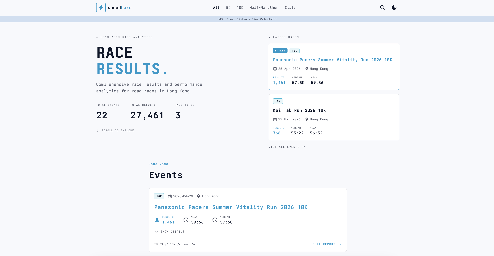

# speedhare

[](https://speedhare.io)
[](https://github.com/GunnarKarlsson/speedhare-website/actions/workflows/ci.yml)
[](LICENSE)
[](https://react.dev)
[](https://www.typescriptlang.org)
[](https://vite.dev)
[](https://nodejs.org)

Hong Kong race analytics — comprehensive race results and performance data for road races.

[speedhare.io](https://speedhare.io) consolidates official, publicly downloadable race results into a searchable archive. Browse 5K, 10K, and half-marathon events, open a race for finisher lists and splits, look up a runner, or use the stats pages and pace calculators.

Data comes from public result files released by organizers — not from scraping websites.



## Run locally

Requires [Node.js](https://nodejs.org) 20.

```bash
npm install
npm run dev
```

Open [http://localhost:5173](http://localhost:5173).

## Scripts

| Script                 | Description                                                                                          |
| ---------------------- | ---------------------------------------------------------------------------------------------------- |
| `npm run dev`          | Vite dev server                                                                                      |
| `npm run build`        | Production build → `dist/` (writes `sitemap.xml` from the API)                                       |
| `npm run preview`      | Serve the production build locally                                                                   |
| `npm run typecheck`    | TypeScript (`tsc --noEmit`)                                                                          |
| `npm run lint`         | ESLint                                                                                               |
| `npm run format`       | Prettier write                                                                                       |
| `npm run format:check` | Prettier check                                                                                       |
| `npm test`             | Vitest (single run)                                                                                  |
| `npm run test:watch`   | Vitest watch mode                                                                                    |
| `npm run ci`           | `format:check` → `lint` → `typecheck` → `test` → `npm audit --omit=dev --audit-level=high` → `build` |

```bash
npm run ci
```

GitHub Actions runs `npm run ci` on pushes and pull requests to `main`. Production builds write `dist/sitemap.xml` from the public API (static routes plus each race). If that fetch fails, the sitemap still includes the static pages.

## Releasing

Merges to `main` (and work on feature branches) do **not** deploy the live site. Production updates are gated by version tags and GitHub Releases:

1. Land the changes on `main` and wait for CI to pass.
2. Align `package.json` `"version"` with the release (e.g. `0.2.0`), then create and push a semver tag from that commit:

```bash
git checkout main
git pull
git tag v0.2.0
git push origin v0.2.0
```

3. Pushing the tag runs the **Draft release** workflow, which opens a **draft** GitHub Release (with generated notes). Nothing is deployed yet.
4. Review the draft under [Releases](https://github.com/GunnarKarlsson/speedhare-website/releases), edit notes if needed, then **Publish release**.
5. Publishing triggers the **Deploy production** workflow, which builds the tagged commit and updates [speedhare.io](https://speedhare.io).

Only tags matching `v*.*.*` (for example `v0.2.0`) participate in this flow. Tags must point at a commit that is on `main`.

## License

MIT — see [LICENSE](LICENSE).

Font files in `src/fonts/` are Ioskeley Mono, licensed under the SIL Open Font License 1.1 — see [src/fonts/LICENSE](src/fonts/LICENSE).
